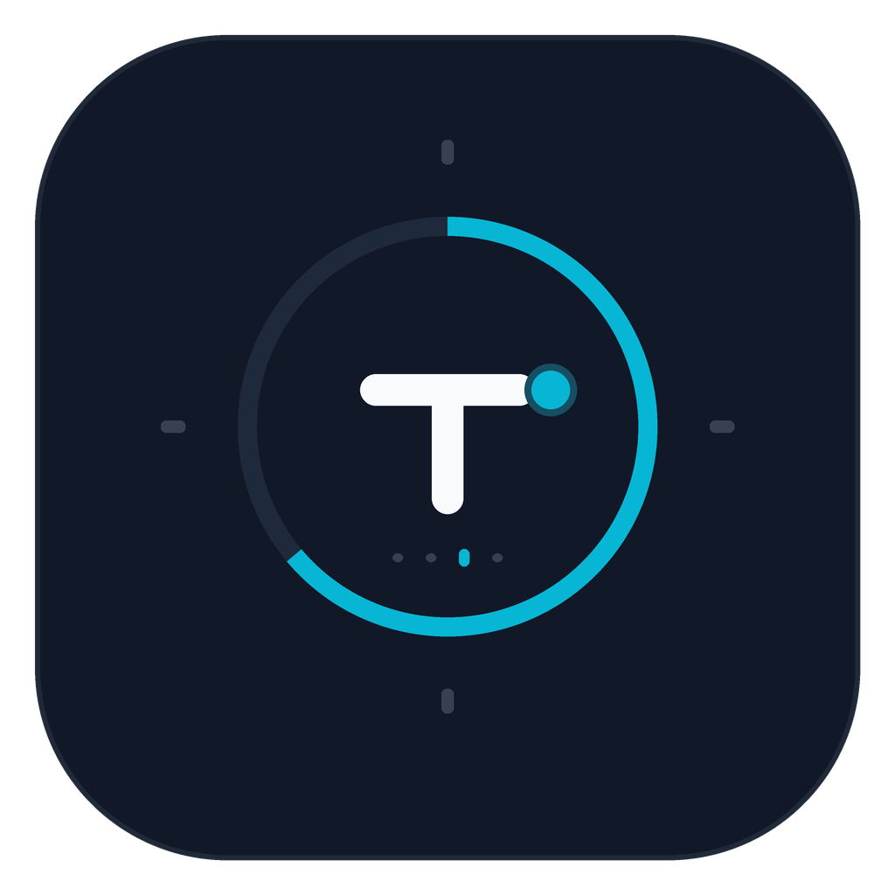

# ⏱️ Timey: Gamified Study Timer & Precision Alarm

<p align="center">
  
</p>

> **The Ultimate Pomodoro, Ultradian & Flow Companion for Android**  
> Built with Kotlin 2.0, Jetpack Compose, Material 3, and a high-precision Java AlarmManager bridge. Zero background freezes, zero drift, and 100% offline.

[](https://github.com/contactaurawealth-lab/Timey/releases/tag/v1.0.0)
[-3DDC84?style=flat-square&logo=android&logoColor=white)](https://developer.android.com)
[](https://kotlinlang.org)
[](https://developer.android.com/jetpack/compose)
[](https://timey-focus.vercel.app)
[](LICENSE)

---

## 📥 Direct APK Download

Download the signed release APK directly:

- **Download Link**: [Timey-v1.0.0.apk](https://timey-focus.vercel.app/downloads/Timey-v1.0.0.apk)
- **Supported Architectures**: `arm64-v8a`, `armeabi-v7a`, `x86`, `x86_64` (Universal APK)
- **Target SDK**: Android 8.0 (API 26) through Android 15+ (API 35)

---

## ✨ Features

### 1. 🔬 4 Science-Backed Focus Engines
- **Classic Pomodoro (25/5)**: 25 minutes of high-intensity focus followed by 5-minute recovery intervals and an automated 15-minute deep recovery block every 4 cycles.
- **Ultradian Deep Work (50/10)**: Engineered for technical topics, programming, and mathematical research that demand 15+ minutes just to achieve cognitive flow.
- **Flowmodoro (Dynamic Ratio)**: Count up unconstrained. When your natural flow pauses, your break is automatically calculated using a configurable $1:5$ ratio.
- **Strict Exam Hall Simulator**: Continuous countdown with midway and 5-minute alerts. Disables pause and enforces strict distraction penalties.

### 2. 🛡️ Unshakeable Background Reliability
- **Android 14+ Foreground Service**: Persistent notification with live chronometer and interactive lock screen controls (`[Pause]`, `[Resume]`, `[+5m]`, `[Finish]`).
- **Hardware RTC Exact Alarms**: Powered by Java `AlarmManager.setAlarmClock()`, guaranteeing alarm triggers at the exact millisecond even during aggressive Android Doze mode and OEM battery optimizations.
- **Strict Anti-Distraction Shield**: Leaves-app detection with an urgent 10-second grace warning before flagging distraction.

### 3. 🐉 The Gamified Komodo Road
- Earn XP for every focused minute.
- Level up your virtual Komodo companion from *Hatchling* $\rightarrow$ *Explorer* $\rightarrow$ *Guardian* $\rightarrow$ *Zenith Mythic*.
- Maintain and visualize your daily streak flame.

---

## 🏛 Architecture & Tech Stack

```
com.timey.app/
├── core/
│   ├── alarm/          # Java 17 ExactAlarmScheduler & AlarmBroadcastReceiver (Zero Drift Bridge)
│   ├── service/        # Android 14+ FocusForegroundService (SPECIAL_USE) & QuickTileService
│   ├── notification/   # BootReceiver & high-priority Notification Channels
│   └── ui/
│       ├── theme/      # Komodo Obsidian, Emerald Dragon, & Fiery Amber color tokens
│       └── component/  # Canvas CircularTimerRing, KomodoRoadCard
├── domain/
│   └── model/          # TimerMode, PomodoroPhase, CompanionState
├── features/
│   └── timer/
│       ├── ui/         # TimerMainScreen (Compose M3)
│       └── viewmodel/  # TimerViewModel (StateFlow & Monotonic Clock)
└── MainActivity.kt     # Lifecycle observer & runtime notification permission handler
```

---

## 🛠 Building from Source

```bash
git clone https://github.com/contactaurawealth-lab/Timey.git
cd Timey

# Assemble Debug APK
./gradlew assembleDebug

# Assemble Release APK
./gradlew assembleRelease
```

---

## 📄 License
Timey is open-source software licensed under the [MIT License](LICENSE).
